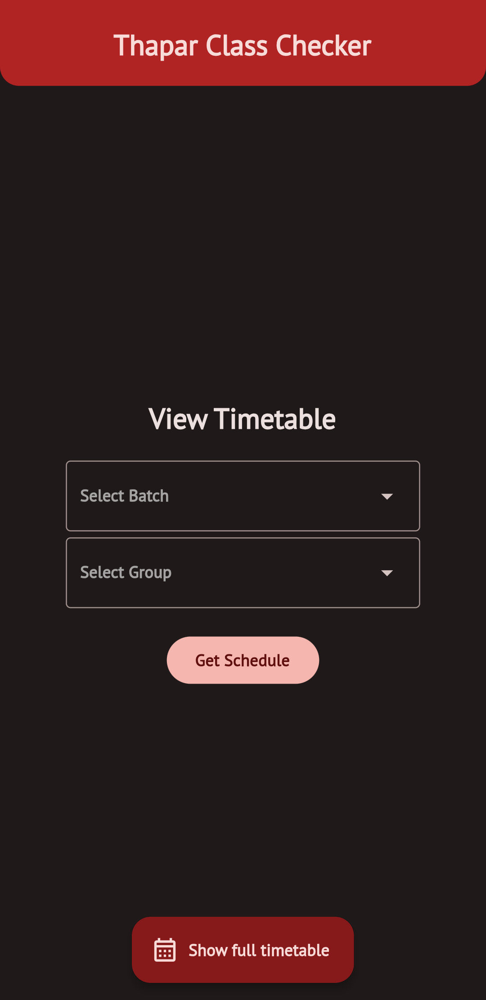
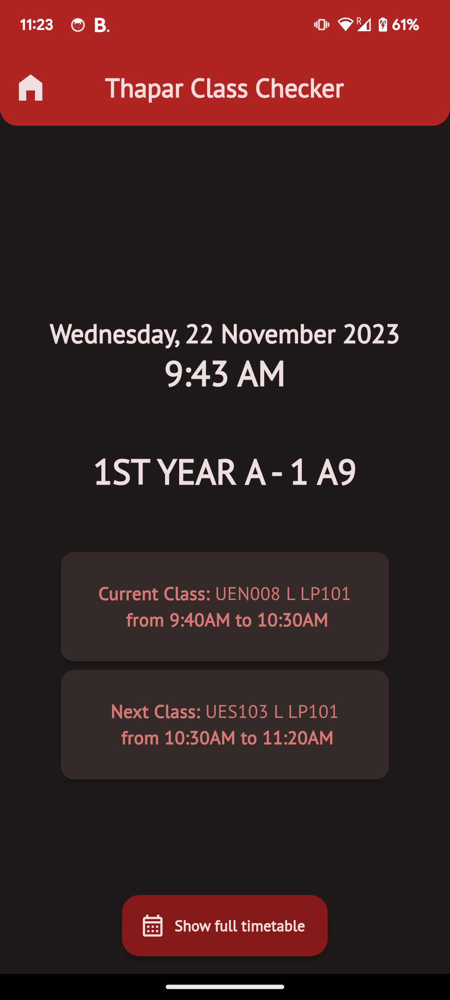

# Thapar Class Checker

An app made in Flutter to easily check current and upcoming classes and also notify about it according to your subgroups, all without internet.

## Screenshots

  
   

## Installation

You can go to [Releases](https://github.com/SakshhamTheCoder/thapar_class_checker/releases) tab and download the .apk file directly into your Android device. Simply install the file and start using the app.

iOS support coming soon...

## Usage

Simply open the app and select your batch and group from the selection menu and click "Get Schedule". You'll get all the info of current and next class (if any) for the current day. You don't need to select your batch and group each time you open the app. So you can see your classes without any hassle and without any internet connection.

You can even open the timetable excel sheet directly through the button provided at the bottom of the app (if you are still skeptical, lol.)

## Inspiration

After I joined this college, I was really having a hard time memorizing the class timetable. It was a very tedious job to open the timetable sheet again and again and look for my group in the ocean of texts and lines. So I decided to make an app that shows me my current and next class instantly, that too without any internet connection.

## Special Thanks

Special Thanks to [Utkarsh Tripathi and other contributers](https://github.com/utkarsh-1905) for making [timetable.mlsctiet.com](https://timetable.mlsctiet.com/) [(GitHub)](https://github.com/utkarsh-1905/time-table) that provides me with the [data.json](https://github.com/SakshhamTheCoder/thapar_class_checker/blob/main/assets/data.json) file for parsing timetable data.

It wouldn't had been possible to make the app without this data file. So, thank you guys. ^^

## 
If you found this app useful, please star this repository and share this app to fellow Thapar students. Thanks : )